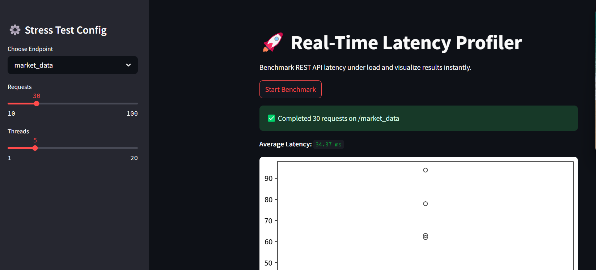
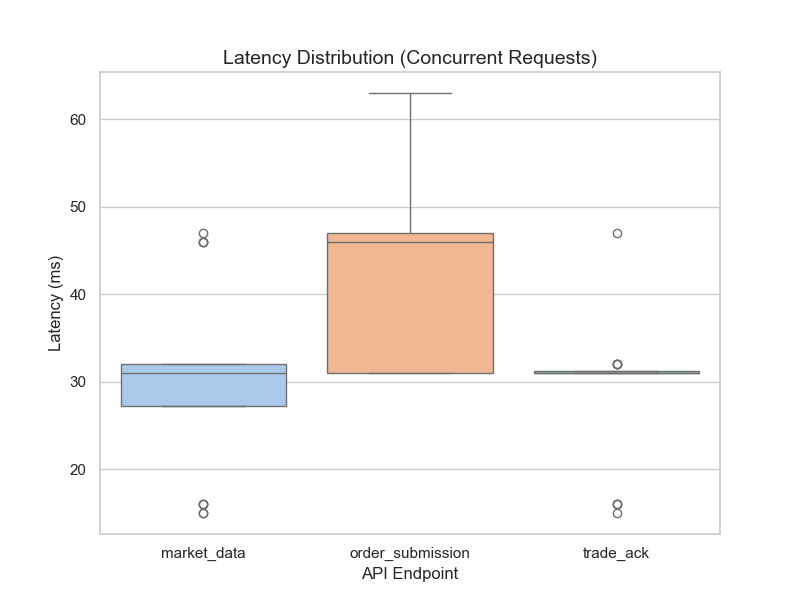

# ⚡ Latency Profiler for REST APIs

> 🚀 A benchmarking suite to simulate and analyze REST endpoint latencies under load — designed with performance-critical applications like **high-frequency trading (HFT)** in mind.

---

## 📌 What This Project Does

- Simulates a trading system backend with 3 REST endpoints (market data, order submission, trade ack).
- Measures round-trip latency with **nanosecond precision** using Python’s `time.monotonic_ns()`.
- Provides CLI scripts + a **real-time Streamlit dashboard** for running tests.
- Visualizes latency spread using **box plots**, highlights outliers and jitter.
- Enables export of results to **CSV** for deeper analysis.

---

## 🛠️ Tech Stack

- **Python 3**
- **Flask** (mock backend)
- **Requests** (benchmarking)
- **Pandas + Seaborn + Matplotlib** (data analysis + visualization)
- **Streamlit** (real-time dashboard)

---

## 🎯 Simulated Endpoints

| Endpoint            | Component Simulated       | Latency Range |
|---------------------|---------------------------|----------------|
| `/market_data`      | Market data feed handler  | 5–15 ms       |
| `/order_submission` | Order router              | 20–35 ms      |
| `/trade_ack`        | Trade confirmation engine | 10–25 ms      |

---

## 📊 Core Features

### ✅ CLI Benchmarking Scripts
- `profiler.py`: Serial latency measurement
- `concurrent_profiler.py`: Multi-threaded load simulation
- `plot.py`: Visualizes data from either CSV

### ✅ Real-Time Streamlit Dashboard
- Select endpoint, threads, request count
- See live results and latency distributions
- Download result CSVs for logs or reports





---

## 🧠 Why This Matters (Use Case)

This project demonstrates awareness of **latency as a first-class system concern** — essential in HFT, SRE, and low-latency backend development roles. It provides tooling to:
- Profile latency and jitter
- Detect spikes and outliers
- Simulate concurrent system load
- Visualize trends in response times

---

## 📁 File Structure
```
latency-profiler/
├── app.py                        # Flask mock server
├── profiler.py                   # Serial benchmark
├── concurrent_profiler.py        # Threaded concurrency test
├── plot.py                       # Data visualization
├── dashboard.py                  # Streamlit UI
├── latency_log.csv               # Serial output
├── concurrent_latency_log.csv    # Concurrent output
├── latency_plot.png              # Plot (serial)
├── latency_plot_concurrent.png   # Plot (concurrent)
├── requirements.txt              # Dependencies
└── README.md                     # Docs
```
---

## 📥 Getting Started

```bash
# 1. Install dependencies
pip install -r requirements.txt

# 2. Start the mock API server
python app.py

# 3. Run benchmark (choose one):
python profiler.py
python concurrent_profiler.py

# 4. Plot the results
python plot.py

# 5. Or launch the dashboard UI
streamlit run dashboard.py
